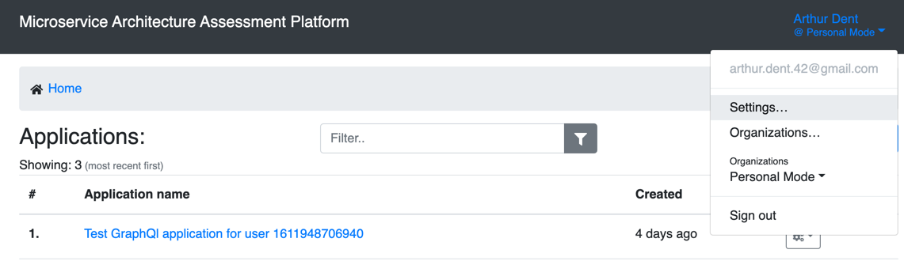
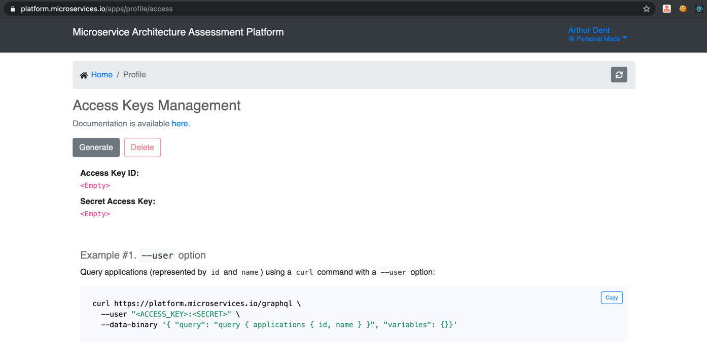

=== How to Locate the https://platform.microservices.io/apps/profile/access[Access Keys Management] Page

* Step 1: From the user menu select 'Settings...'

to navigate to the https://platform.microservices.io/apps/profile[Settings page].

* Step 2: From this page, press on 'Access Keys' button:

image::images/img-01-settings-navigate-to-keys.png[align="center", width=90%]

=== How to Generate Keys in the Console

From the https://platform.microservices.io/apps/profile/access[Access Keys Management] Page, press the 'Generate' button:

In a few moments the Access Key ID and the Secret Access Key will have been generated, the examples will have these values incorporated in them:

image::images/img-03-access-keys-generated.png[align="center", width=90%]

